<div align="center">


<h1>Cloud Cost Anomaly Detection</h1>

<p><strong>The Enterprise Flagship Platform for Real-Time Cost Intelligence & Multi-Cloud Spend Governance</strong></p>

[]()
[]()
[]()
[]()
[]()

<br/>

> **"Uncontrolled cloud spend is the silent killer of digital transformation."** 
> Cloud Cost Anomaly Detection is an industrial-grade intelligence platform designed to provide Finance and Engineering leaders with a real-time radar for unusual spend patterns, ensuring fiscal accountability in a multi-cloud world.

</div>

---

## 🏛️ Executive Summary

The **Cloud Cost Anomaly Detection** platform is a transformation-focused solution designed for CFOs, CTOs, and FinOps leaders. As organizations scale their cloud footprint across Azure, AWS, and GCP, the complexity of billing data often obscures critical spend spikes until the monthly invoice arrives—often too late for remediation.

This platform automates the ingestion of granular billing data (CUR, Azure Export) and applies advanced time-series anomaly detection models to identify deviations from historical baselines. By providing real-time alerts, root-cause analysis, and executive dashboards, it empowers organizations to shift from "reactive cloud spend" to "proactive cost governance."

---

## 💡 Why Cloud Cost Anomalies Matter

In a cloud-native environment, resources are ephemeral and infinitely scalable. While this provides agility, it also introduces significant financial risk:
- **The "Runaway" Service**: A misconfigured developer script or an infinite loop in a serverless function can generate thousands of dollars in costs in hours.
- **Untagged Sprawl**: New resources created without proper cost-center tags lead to "orphan spend" that cannot be easily attributed.
- **Data Egress Spikes**: Unusual data transfer patterns can indicate both a misconfigured architecture and a potential security breach (data exfiltration).
- **Idle Resources**: Massive GPU instances or high-tier databases left running after a proof-of-concept project.

---

## 🚀 Business Outcomes & FinOps Maturity

### 🎯 Key Business Outcomes
- **Financial Predictability**: Minimize "invoice shock" by identifying anomalies within 24 hours.
- **Operational Accountability**: Automatically route alerts to the specific engineering team responsible for the spend spike.
- **Optimized Unit Economics**: Track cost per transaction/user and detect efficiency regressions.
- **Reduced Waste**: Identify savings opportunities (RI/SP) based on real-time utilization trends.

### 📈 FinOps Maturity Alignment
| Phase | Maturity Level | Capability in Platform |
|---|---|---|
| **Inform** | Crawl | Multi-cloud ingestion, basic dashboarding, tagging gaps. |
| **Optimize** | Walk | Automated anomaly detection, trend analytics, RI waste signals. |
| **Operate** | Run | Real-time alerting, automated remediation workflows, executive KPI scorecards. |

---

## 🛠️ Technical Stack

| Layer | Technology | Rationale |
|---|---|---|
| **Cloud** | Azure + AWS | Native multi-cloud support for enterprise hybrid estates. |
| **Frontend** | React 18, Vite, Tailwind CSS | High-performance, responsive UI with modern DX. |
| **Backend** | FastAPI (Python) | High-concurrency, asynchronous API for ingestion and scoring. |
| **Anomaly Engine** | Scikit-learn, Pandas, Prophet | Statistical and ML models for time-series decomposition. |
| **Database** | PostgreSQL | Relational storage for billing metadata and historical baseline. |
| **Queue** | Redis | Scalable async processing for large-scale ingestion jobs. |
| **Infra (IaC)** | Terraform | Multi-provider orchestration for FinOps infrastructure. |
| **Deployment** | AKS / EKS | Scalable, resilient container orchestration. |

---

## 📐 Architecture Storytelling: 35+ Diagrams

### 1. Executive High-Level Architecture
The holistic view of how billing data flows from cloud providers to executive insights.

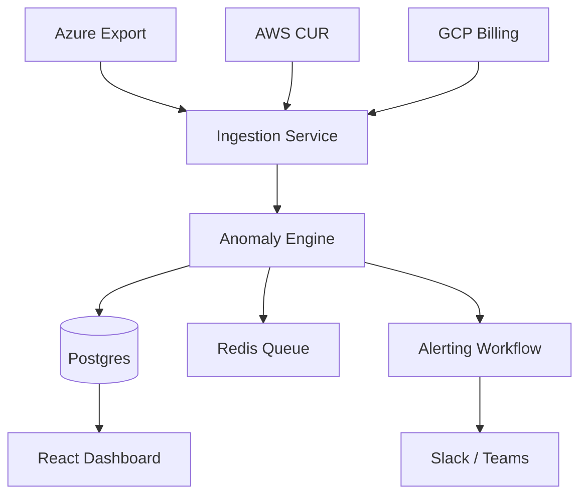

### 2. Detailed Component Topology
The internal service mesh and data persistence layer within the FinOps cluster.

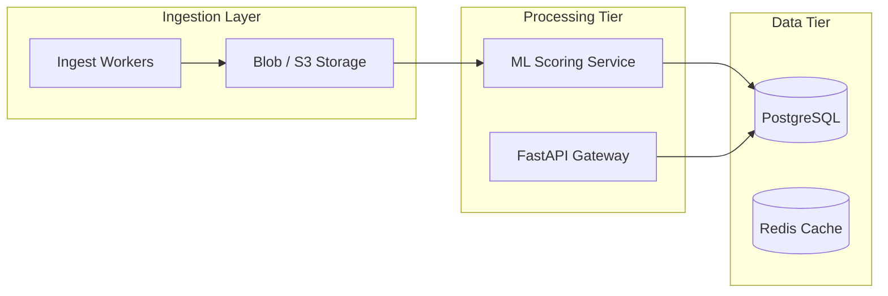

### 3. Frontend to Backend Request Path
Tracing a user's journey from the dashboard to the underlying cost data.

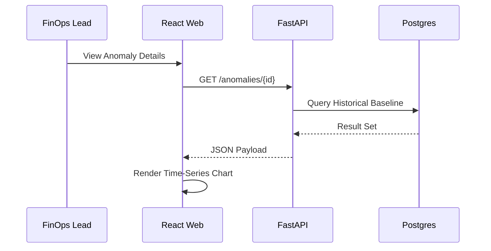

### 4. Data Lake / Warehouse Model
How raw billing files are transformed into actionable cost intelligence.

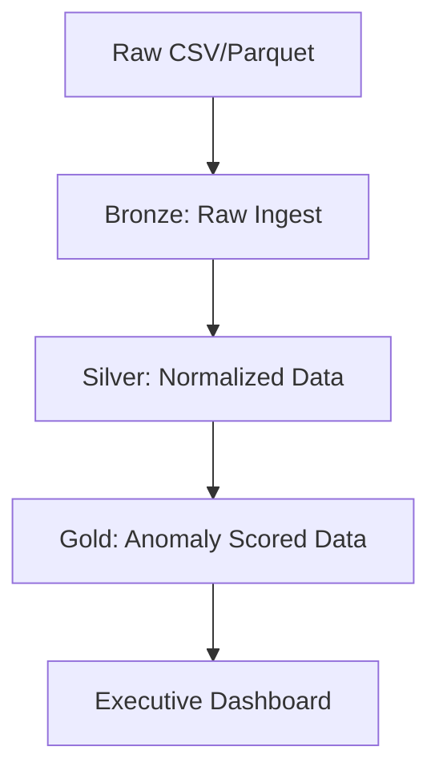

### 5. Multi-Cloud Ingestion Topology
Managing connections across disparate cloud billing APIs.

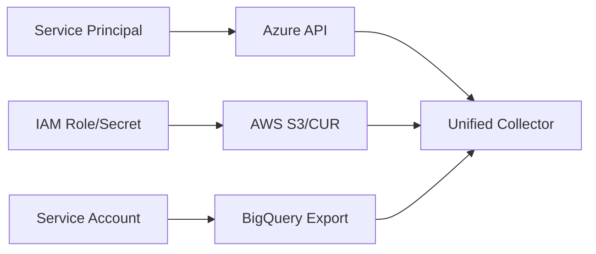

### 6. Regional Deployment Model
Deploying the FinOps platform for global data residency compliance.

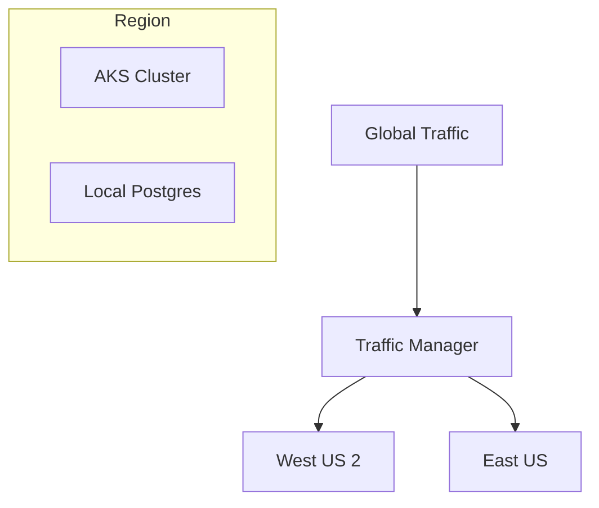

### 7. DR Failover Model
Ensuring the "Cost Radar" never goes offline during a regional failure.

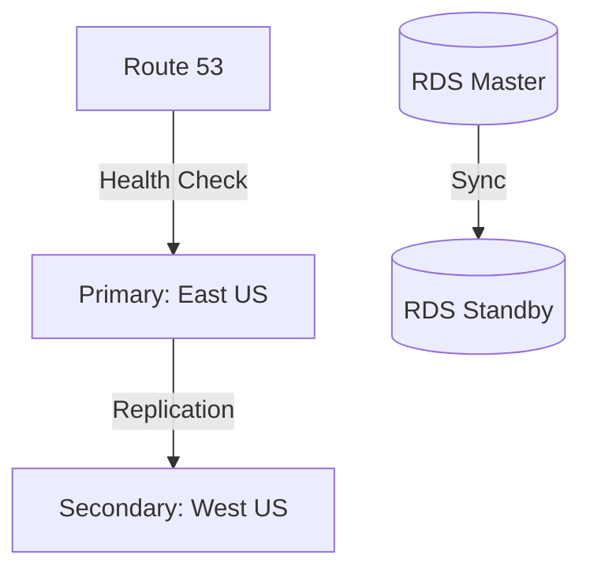

### 8. API Gateway Architecture
Managing security, throttling, and routing for the FinOps API.

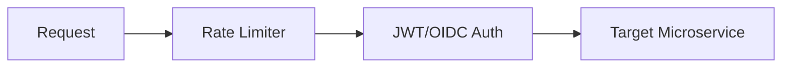

### 9. Queue Worker Architecture
Handling the "Heavy Lifting" of multi-gigabyte billing file processing.

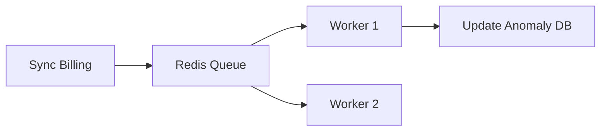

### 10. Dashboard Data Flow
How the React UI refreshes its intelligence in real-time.

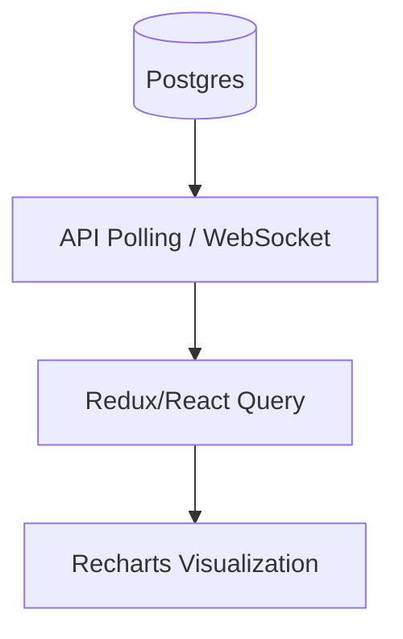

### 11. Billing Ingestion Workflow
The systematic process of retrieving, decrypting, and parsing multi-cloud billing files.

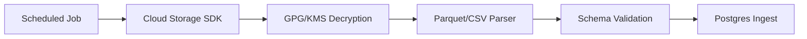

### 12. Daily Variance Detection Flow
Comparing today's spend against the 30-day moving average.

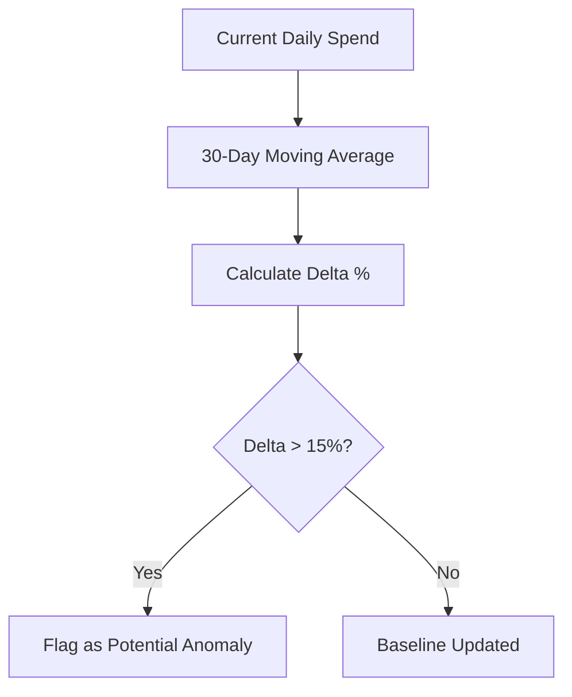

### 13. Time-Series Anomaly Model
Decomposing spend into trend, seasonality, and residual components.

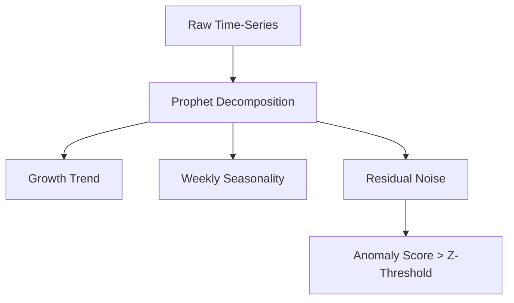

### 14. Seasonality Adjustment Model
Accounting for predictable spikes like end-of-month reporting or weekly batch jobs.

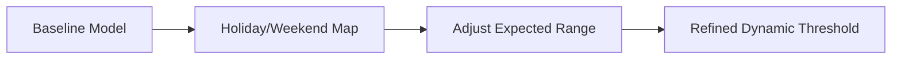

### 15. Cost Spike Root Cause Flow
Drilling down from a total spend spike to the specific resource ID.

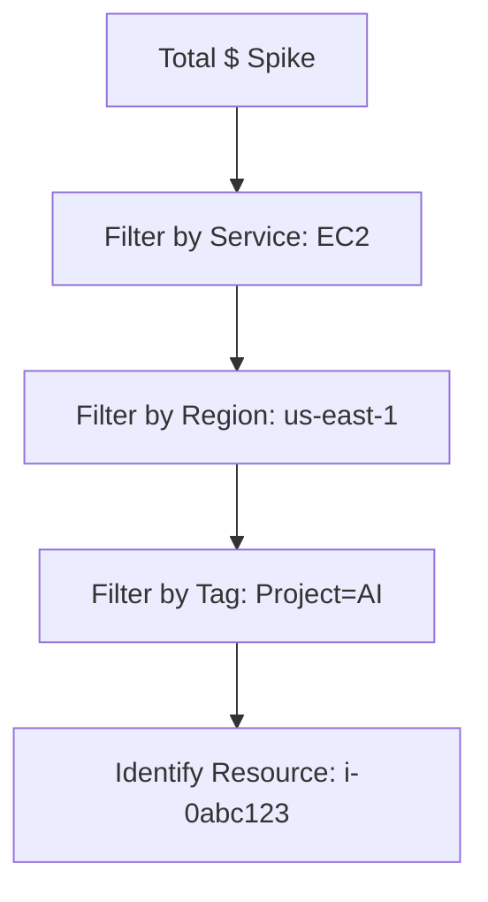

### 16. Service-Level Attribution Flow
Mapping cloud services to internal business units.

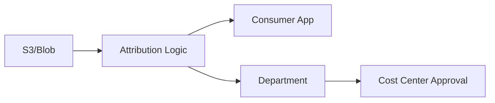

### 17. Tag Gap Detection Flow
Identifying resources missing mandatory governance tags.

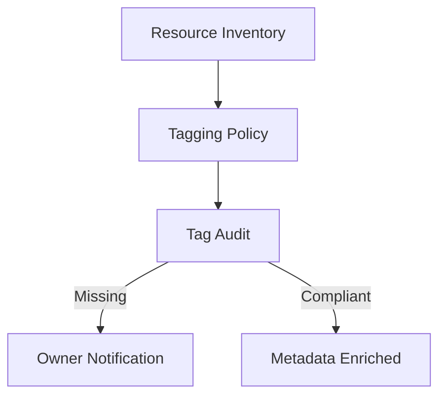

### 18. Savings Plan Waste Model
Detecting under-utilized commitment-based discounts.

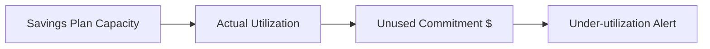

### 19. Forecast Pipeline
Predicting future spend based on historical velocity and seasonal factors.

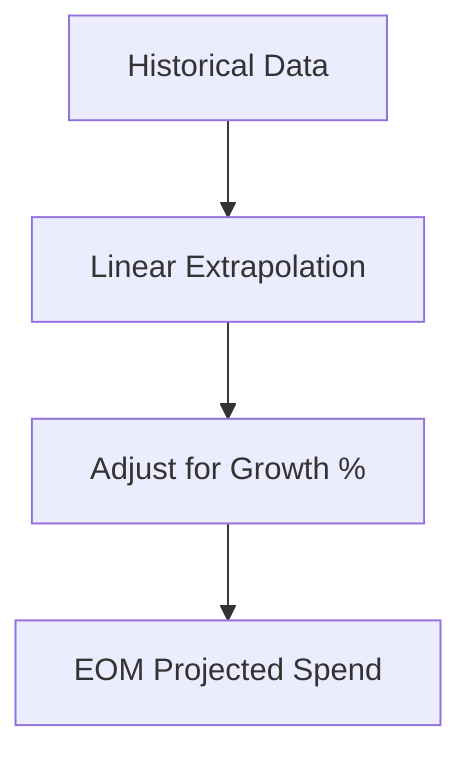

### 20. Recommendation Engine Flow
Generating actionable optimization tasks.

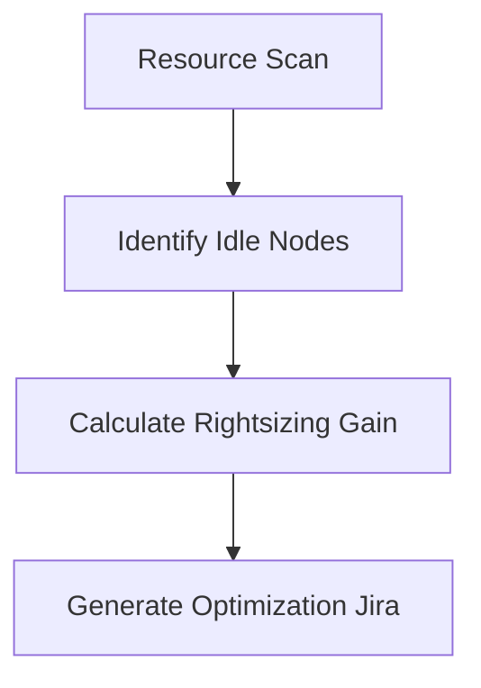

### 21. Alert Escalation Workflow
Ensuring high-severity anomalies reach the CFO's desk if unresolved.

```mermaid
graph TD
    Alert[Anomaly Detected] --> P3[P3: Dev Notification]
    P3 -->|24h No Ack| P2[P2: Manager Escalation]
    P2 -->|48h No Ack| P1[P1: FinOps Lead / CFO]
```

### 22. Slack / Teams Notification Model
Rich interactive alerts delivered to chat platforms.

```mermaid
graph LR
    Event[Anomaly] --> Hook[Webhook Service]
    Hook --> Payload[Rich Block Payload]
    Payload --> Slack[Post to #finops-alerts]
```

### 23. Approval Workflow for Actions
The human-in-the-loop process for approving rightsizing recommendations.

```mermaid
stateDiagram-v2
    [*] --> Pending
    Pending --> Approved: Tech Lead Sign-off
    Pending --> Rejected: Risk Too High
    Approved --> Execution: Automation Trigger
```

### 24. Weekly FinOps Review Lifecycle
The rhythm of business for cost governance.

```mermaid
graph LR
    Collect[Collect Anomalies] --> Review[Weekly Triage]
    Review --> Assign[Assign Actions]
    Assign --> Verify[Verify Savings]
```

### 25. Incident Response Workflow
The operational path for responding to "Spend Explosions."

```mermaid
graph TD
    Detect[Spike > $10k/day] --> WarRoom[Trigger FinOps War Room]
    WarRoom --> Stop[Kill Runaway Process]
    Stop --> RCA[Root Cause Analysis]
```

### 26. Monthly Governance Review Flow
The executive meeting to review budget performance and transformation progress.

```mermaid
graph TD
    Data[Monthly Aggregates] --> Exec[Exec Summary Pack]
    Exec --> Board[Governance Committee]
    Board --> Strategy[Adjust Cloud Strategy]
```

### 27. OIDC / SSO Auth Flow
Secure enterprise access using Microsoft Entra / Okta.

```mermaid
sequenceDiagram
    participant U as User
    participant A as FinOps App
    participant I as Entra ID
    
    U->>A: Click Login
    A->>I: Auth Request
    I-->>A: JWT Token
```

### 28. RBAC Model
Granular permissions for finance, engineering, and admins.

```mermaid
graph LR
    Finance -->|Read| Reports
    Engineer -->|Manage| Recommendations
    Admin -->|Full| System
```

### 30. Audit Logging Architecture
Tracking all changes to anomaly thresholds and remediation actions.

```mermaid
graph LR
    Action[User Edit] --> Log[JSON Event]
    Log --> Hub[Event Hub]
    Hub --> Store[Immutable Audit Blob]
```

### 31. Network Boundary Model
Protecting the FinOps platform and billing data.

```mermaid
graph LR
    User --> WAF[Azure WAF]
    WAF --> VNet[Private Virtual Network]
    VNet --> DB[(Private SQL)]
```

### 32. Metrics Pipeline
Monitoring the health of the anomaly engine itself.

```mermaid
graph LR
    Engine[Anomaly Job] --> Prom[Prometheus]
    Prom --> Grafana[Grafana Dash]
```

### 33. Logging Flow
Centralized log management for the monorepo.

```mermaid
graph TD
    API[API Logs] --> ELK[Elasticsearch / Log Analytics]
    Worker[Worker Logs] --> ELK
```

### 34. Tracing Model
Observing cross-service requests for ingestion jobs.

```mermaid
sequenceDiagram
    participant C as Cron
    participant W as Worker
    participant S as Storage
    
    C->>W: Start Sync (TraceID: 123)
    W->>S: Read File (TraceID: 123)
```

### 35. SLA Monitoring Model
Tracking the availability of the "Cost Radar."

```mermaid
graph LR
    Probe[Uptime Probe] --> SLA[99.9% Availability]
```

---

## 🔬 Anomaly Detection Methodology

The platform utilizes a **hybrid detection engine** that combines statistical thresholds with machine learning models to maximize precision and minimize "alert fatigue."

### 1. Statistical Baseline (Z-Score)
We calculate the mean and standard deviation of spend over a rolling 30-day window. Any spend outside of **3 Standard Deviations** is flagged as a statistical outlier.

### 2. Time-Series Decomposition (Seasonal Adjustment)
Cloud spend is inherently seasonal (e.g., lower on weekends, higher during end-of-month batch cycles). We use **Facebook Prophet** to decompose the signal:
- **Trend**: Long-term growth or decline in spend.
- **Seasonality**: Repeating patterns (Daily, Weekly).
- **Holidays**: Adjustments for major public holidays where activity typically drops.

### 3. Ensemble Scoring
An anomaly is only escalated to "High Severity" if it is confirmed by multiple models (e.g., Z-Score > 3 AND Residual Error > 20%).

---

## 💼 FinOps Operating Model

Implementing this platform is only 50% of the journey. The other 50% is the **human operating model**:

| Activity | Frequency | Stakeholders | Outcome |
|---|---|---|---|
| **Anomaly Triage** | Daily | FinOps Engineer, App Owner | Resolve or acknowledge spikes within 24h. |
| **Commitment Review** | Weekly | FinOps Lead, Procurement | Buy or adjust RI/SP based on utilization signals. |
| **Executive Briefing** | Monthly | CFO, CTO | Align cloud spend with business growth and unit economics. |

---

## 🚦 Getting Started

### 1. Prerequisites
- **Azure CLI** and **AWS CLI** installed and configured.
- **Terraform** (v1.5+).
- **Docker Desktop**.
- **Python 3.11+**.

### 2. Local Setup
```bash
# Clone the repository
git clone https://github.com/Devopstrio/cloud-cost-anomaly-detection.git
cd cloud-cost-anomaly-detection

# Setup environment
cp .env.example .env

# Launch core services
docker-compose up --build
```
The dashboard will be available at `http://localhost:3000`.

### 3. Multi-Cloud Ingestion Setup
1. **Azure**: Create a "Cost Management Export" to an Azure Storage Account.
2. **AWS**: Enable "Cost & Usage Reports" (CUR) to an S3 bucket with Parquet format.
3. **App Config**: Add the bucket/account credentials to the platform via the `/admin` portal.

---

## 🛡️ Governance & Security
- **Data Sovereignty**: The platform runs in your VPC/VNet. No billing data leaves your controlled environment.
- **Least Privilege**: Ingestion workers use Read-Only roles for billing storage.
- **Encryption**: All billing files are encrypted with Customer Managed Keys (CMK) at rest.

---

## 📈 Roadmap
- [ ] **LLM Root Cause Analysis**: Natural language explanations of spend spikes using GPT-4o.
- [ ] **Kubernetes Granularity**: Deep-dive into pod-level cost attribution using Kubecost integration.
- [ ] **Automated Remediation**: "Auto-stop" policies for non-production anomalies.

---
<sub>&copy; 2026 Devopstrio &mdash; Engineering the Future of Cloud Economics.</sub>
